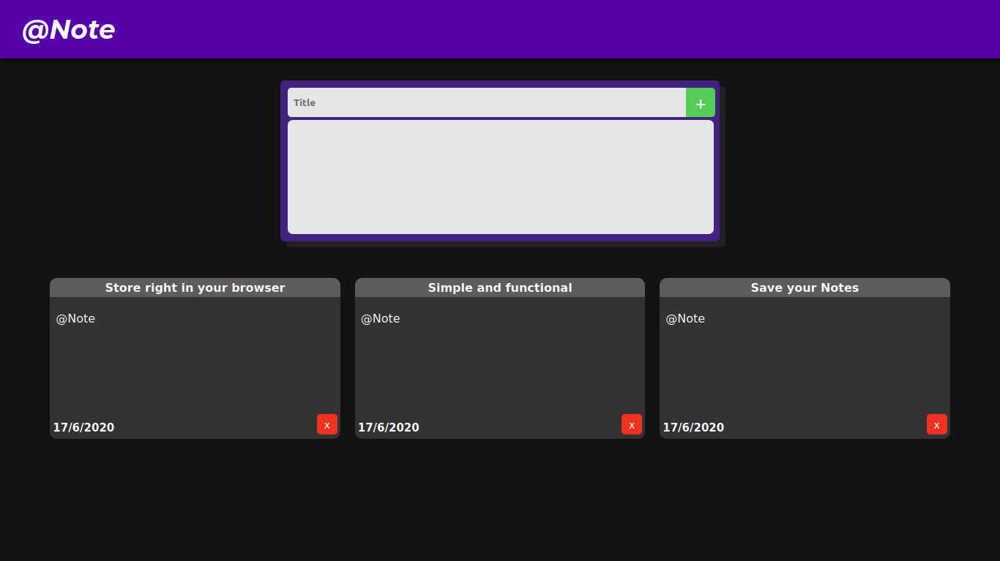
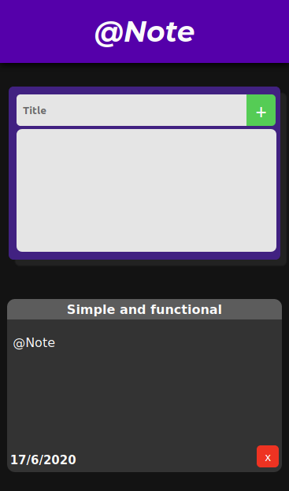

# @Note

### **@Note** is an online notepad that stores your notes in the browser you are using. With it, you can place or delete your notes and check the date you post the notes.
### Link: https://anotereact.herokuapp.com

## Built with:
- ReactJs
- Javascript
- HTML
- CSS

## Preview

  
  

## Instructions
#### -Clone the project
#### -if you don't have nodeJS on your device, install https://nodejs.org/en/download/
#### -Execute your terminal on the project folder
#### -Insert the `npm i`
#### -To run, insert `npm run start`
